# Competition Page Best Practices

This document outlines the recommended patterns and components for creating competition rulebook pages using Astro Starlight.

## File Format

Use `.mdx` extension instead of `.md` to enable:
- Astro component imports
- JSX syntax in markdown
- Dynamic content with JavaScript expressions

```mdx
---
title: Competition Name
description: Brief description of the competition
sidebar:
  order: 4
---

import { Aside, Steps, Card, CardGrid, LinkButton } from '@astrojs/starlight/components';
import { OFFICIAL_RULEBOOK_URL } from '../../../../consts';
```

---

## Page Structure

### 1. Competition Badges

Add visual badges at the top to quickly communicate key competition info:

```html
<div class="competition-badges">
  <span class="badge badge-bracket">Bracket</span>
  <span class="badge badge-team">Team (4-6)</span>
  <span class="badge badge-type">Gender Segregated</span>
</div>
```

### 2. PDF Deep Link Button

Use Starlight's `LinkButton` component for a styled, theme-consistent button:

```jsx
<LinkButton href={`${OFFICIAL_RULEBOOK_URL}#page=79`} target="_blank" icon="external" variant="secondary">
  View Official PDF (Page 79)
</LinkButton>
```

**Benefits:**
- Consistent styling with theme
- External link icon
- Opens in new tab
- Deep links to specific PDF page

---

## Content Components

### Steps Component

Use for sequential procedures and round structures:

```jsx
<Steps>

1. First step description
2. Second step with **bold** emphasis
    - Sub-bullet for additional detail
    - Another sub-point
3. Third step

</Steps>
```

### Aside Component

Use for important notes, warnings, or tips:

```jsx
<Aside type="note" title="Note">
In the event that 4 teams or fewer register, rounds can be skipped.
</Aside>
```

**Types:** `note`, `tip`, `caution`, `danger`

### CardGrid for Examples

Display related items in a responsive grid:

```jsx
<CardGrid>
  <Card title="One Sentence Scenario" icon="comment">
    You're in the operating room but the surgeon is afraid of scalpels.
  </Card>
  <Card title="Conditions" icon="warning">
    Speak only in rhymes
  </Card>
</CardGrid>
```

---

## Visual Diagrams

### Mermaid Flowcharts

Visualize bracket structures and tournament flow:

```mermaid
flowchart TD
    subgraph PRELIMS["🎭 Preliminary Round"]
        A["All Teams"] --> B["Play 2 Games"]
        B --> C["Scores Combined"]
    end
    
    subgraph SEMIS["🏆 Semifinals"]
        D["Top 4 Teams"] --> E["2 Games"]
    end
    
    C --> D
```



**Note:** Requires `astro-mermaid` package installed and configured.

---

## Interactive Components

### Interactive Ballot

For scoring ballots, create a custom Astro component with:
- Input fields for each criteria (0-20 range)
- Auto-calculation of totals per game
- Average score calculation
- Responsive table layout

**Location:** `src/components/InteractiveBallot.astro`

**Usage:**
```jsx
import InteractiveBallot from '../../../../components/InteractiveBallot.astro';

## Detailed Ballot
<InteractiveBallot />
```

**Features:**
- `<input type="number" min="0" max="20">` for score entry
- JavaScript for real-time total calculation
- CSS styling using Starlight CSS variables (`--sl-color-*`)
- Full criteria descriptions from official rulebook

---

## Centralized Configuration

### PDF URL

Store the official PDF URL in a central config file:

**`src/consts.ts`:**
```typescript
export const OFFICIAL_RULEBOOK_URL = 'https://example.com/Rulebook-2026.pdf';
```

**Benefits:**
- Single source of truth
- Easy to update when rulebook changes
- Consistent across all pages

---

## Markdown Best Practices

### Nested Lists

Use proper indentation (4 spaces) for nested items:

```markdown
1. Main point
    - Sub-bullet one
    - Sub-bullet two
2. Second main point
```

### Self-Closing Tags

In MDX, always use self-closing HTML tags:

```jsx
// ✅ Correct
<br />

// ❌ Incorrect (causes MDX error)
<br>
```

---

## Installed Plugins

The following Starlight plugins enhance competition pages:

| Plugin | Purpose |
|--------|---------|
| `astro-mermaid` | Flowchart/diagram rendering |
| `starlight-scroll-to-top` | Scroll-to-top button |
| `starlight-sidebar-swipe` | Mobile sidebar gestures |
| `starlight-videos` | Video embedding support |

---

## Page Template

```mdx
---
title: [Competition Name]
description: Rules and format for MIST [Competition] competition
sidebar:
  order: [number]
---

import { Aside, Steps, Card, CardGrid, LinkButton } from '@astrojs/starlight/components';
import { OFFICIAL_RULEBOOK_URL } from '../../../../consts';
import InteractiveBallot from '../../../../components/InteractiveBallot.astro';

<div class="competition-badges">
  <span class="badge badge-bracket">[Type]</span>
  <span class="badge badge-team">[Team Size]</span>
  <span class="badge badge-type">[Category]</span>
</div>

<LinkButton href={`${OFFICIAL_RULEBOOK_URL}#page=[PAGE]`} target="_blank" icon="external" variant="secondary">
  View Official PDF (Page [PAGE])
</LinkButton>

## Format
[In-Person/Virtual/Hybrid]

## Registration Guidelines
1. [Guideline one]
2. [Guideline two]

## Overview
[Competition description]

## Competition Structure
<Steps>
1. [Round one]
2. [Round two]
</Steps>

### Bracket Flow
[Mermaid diagram]

<Aside type="note" title="Note">
[Important notes or exceptions]
</Aside>

## Procedure
<Steps>
[Numbered procedure steps with sub-bullets]
</Steps>

## Detailed Ballot
<InteractiveBallot />
```
