import { Aside, Steps, LinkButton } from '@astrojs/starlight/components';
import { OFFICIAL_RULEBOOK_URL } from '../../../../consts';

  Bracket
  Team (2)
  In-Person

<LinkButton href={`${OFFICIAL_RULEBOOK_URL}#page=63`} target="_blank" icon="external" variant="secondary">
  View Official PDF (Page 63)
</LinkButton>

Are you great at winning arguments? Do you have the poise of a public speaker and the convincing tone of a scholar? Join debate to compete with others who are just like you.

## Format
In-Person

## Registration Guidelines

1. A maximum of **two (2) students** from each team may register for this competition, with no substitutions.
2. This competition is a team effort, but students are also permitted to register solo. If solo, students must fill both roles for their team.

## Overview

MIST Parliamentary Debates attempt to transform detailed discussions that occur in the House of Commons to a format that teaches principles of reasoning, argument, and quick wit. The Resolutions (i.e. debate topics) of Parliamentary Debates must be a question of policy (ex. Capital punishment is an effective deterrent to murder).

## Competition Structure

Parliamentary Debate is a **Bracket Competition** (elimination format):

- Two rounds of Preliminaries
- One Quarterfinal Round (top 8 teams)
- One Semifinal Round (top 4 teams)
- One Final Round

### Bracket Flow

```mermaid
flowchart TD
    subgraph PRELIMS["📋 Preliminaries"]
        A["All Teams"] --> B["Round 1"]
        B --> C["Round 2"]
        C --> D["Win-Loss Record"]
    end
    
    subgraph QUARTERS["🏅 Quarterfinals"]
        E["Top 8 Teams"]
    end
    
    subgraph SEMIS["🏆 Semifinals"]
        F["Top 4 Teams"]
    end
    
    subgraph FINALS["🥇 Finals"]
        G["Final 2 Teams"]
        H["3rd Place Match"]
    end
    
    D --> E
    E --> F
    F --> G
    F --> H
```

<Aside type="note" title="Odd Number of Teams">
In the event that an odd number of teams are present at the first preliminary round, even-numbered pairs will be made, with a randomized odd team sitting out the first preliminary and competing in the 2nd preliminary round. All teams regardless of round results advance to Round 2 of preliminaries.
</Aside>

## Scoring System

Debate follows a **win versus loss structure** (not points-based).

### Tie-Breaking (for same win-loss ratio)

<Steps>

1. **Opponent Strength Score**: Measured by the win-loss ratios of the team's opponents. This prevents easy schedule biases in preliminary rounds.
   - Example: A team with a 1-1 ratio that wins against a team with 0 wins ranks lower than a 1-1 team that beat a stronger opponent.

2. **Speaker Rankings**: Judges rank speakers on teams 1-4 in terms of speaking ability.
   - Teams with better speakers rank higher.
   - For solo competitors, rankings apply to both roles separately.
   - Write ranks next to MIST IDs in the Debate Ballot.

</Steps>

## Roles and Terminology

| Term | Meaning |
|------|---------|
| **Speaker** | The moderator of the debate |
| **Government** | The affirmative side |
| **Opposition** | The negative side |
| **House** | Participants and audience collectively |
| **Bill** | The resolution being debated |

Debaters must address themselves to "Mr. [or Madam] Speaker" at the outset of their speeches. Debaters must always refer to one another in the third person (e.g., "the Prime Minister", "Leader of the Opposition") — never by real names.

### Government Roles
- **Prime Minister (PM)**: First speaker for Government
- **Crown Minister (CM)**: Second speaker for Government

### Opposition Roles
- **Leader of the Opposition (LO)**: First speaker for Opposition
- **Member of the Opposition (MO)**: Second speaker for Opposition

## Debate Structure

| Speaker | Role | Time |
|---------|------|------|
| Prime Minister (PM) | Constructive Speech | 6 min |
| Leader of Opposition (LO) | Constructive Speech | 6 min |
| Crown Minister (CM) | Constructive Speech + Rebuttal | 6 min |
| Member of Opposition (MO) | Constructive Speech + Rebuttal | 6 min |
| Prime Minister (PM) | Rebuttal | 3 min |
| Leader of Opposition (LO) | Rebuttal | 3 min |

### Speech Details

**PM Constructive Speech (6 min):**
- Has the Burden of Proof — must show why the government side must be adopted
- Introduces resolution, defines major terms
- Presents basic government case with 3+ constructive points

**LO Constructive Speech (6 min):**
- Presents a new independent argument relating to the case
- Outlines why the government case is flawed/wrong
- Refutes the government case

**CM Constructive + Rebuttal (6 min):**
- Brings forth 1-2 additional arguments supporting the government
- Rebuilds the Government position and original PM points
- Rebuts points presented by the LO

**MO Constructive + Rebuttal (6 min):**
- Brings forth bulk of opposition arguments (3-4 points)
- Rebuilds Opposition position
- May pose questions to the Government

**PM Rebuttal (3 min):**
- Rebuilds critical aspects of Government case
- Sums up entire debate showing why Government won
- **No new evidence or arguments**

**LO Rebuttal (3 min):**
- Offers final rebuttal to Government
- Summarizes Opposition side and restates points
- **No new evidence or arguments**

## Points of Information (POI)

Points of Information are a unique feature of Parliamentary Debates — opportunities for debaters to rise during the opposition's speeches and offer a question or comment.

### POI Rules

- To request a POI: Say "Point of Information" and place one hand on head, one hand palm up
- Speaker may decline by waving down or saying "No thank you"
- POIs must be brief: **5-10 seconds**
- Maximum **2 POIs** per speech
- POIs **cannot** be offered during first and last minute of constructive speeches
- POIs **cannot** be offered during the final LO and PM rebuttals (protected time)

## Procedure

<Steps>

1. The total scores from each preliminary round will be calculated and the 8 teams with the best records will proceed to the next round.

2. The moderator (Speaker) introduces debaters. All debaters must address "Mr./Madam Speaker" at the outset of speeches.

3. Members will speak only when called upon by the Speaker or when allowed a "Point of Information."

4. Debaters shall not use profane or offensive language.

5. **No AI permitted** for competition prep. Usage is grounds for point loss and/or disqualification.

6. During final rebuttals, debaters may not bring up new arguments or evidence except in direct refutation of material already presented.

7. Competitors may bring notes and outlines on the Resolution. Electronic device usage is **not** permitted.
   - Scrap paper will be provided if needed for tracking arguments.

8. Competitors will not be permitted to view completed ballots until the tournament's conclusion.

9. In the event of fewer than 8 teams, top 6 proceed to quarterfinals.

10. Parliamentary Debate topics are available at [getmistified.com/rulebook](https://www.getmistified.com/rulebook).

</Steps>

## The Speaker's Script

The Speaker acts as timekeeper and introduces each debater. Before beginning:
- Write the exact resolution and debater names in speaking order on a visible board
- Flip a coin to determine Government vs Opposition

**After each speech:**
1. After PM: "I thank the Prime Minister for his/her remarks. We shall now hear the Leader of Opposition."
2. After LO: "Thank you for your remarks. I now call upon the Crown Minister to deliver his/her speech."
3. After CM: "Thank you. A speaker for the Opposition will now deliver a speech opposing the Bill."
4. After MO: "I thank the member of the Opposition, and now call upon the Prime Minister to present the Government's final rebuttal. During this final rebuttal, no new arguments may be made."
5. After PM Rebuttal: "Thank you. The Leader of the Opposition will now deliver the last speech opposing the Bill."
6. Closing: "On behalf of the House, I thank the Judges for their assistance; I congratulate all the debaters on their performances; and I thank the members of the House for their attentiveness. Since this debate is now concluded and there is no other business on the Order Paper, the House stands adjourned."

## Judging Criteria

| Criteria | Description |
|----------|-------------|
| **Organization** | Speech is well structured, logical & coherent, with effective introduction and conclusion |
| **Evidence/Logic** | Facts, statistics & authorities offered are sound. Credit for thorough, relevant research |
| **Delivery** | Poise, voice quality, emphasis, variety, enunciation, gestures, eye contact |
| **Refutation/Clash** | Ability to apply logic and evidence in refuting opponents while defending own contentions |
| **Format** | Understanding of parliamentary procedure, adherence to rules, appropriate use of points of order |

<Aside type="caution" title="Note to Judges">
The end goal is to decide which team presented the most compelling arguments and best defense — not only quality of delivery. Judges must never allow personal biases concerning debaters or topics to impact their ruling.
</Aside>

## Important Notes

<Aside type="note" title="For Organizers">
- Only the top 4 teams from debate may qualify for the National Tournament.
- Regions must hold a 3rd place match concurrently with the final match, so semi-finalists are guaranteed 2 matches each.
</Aside>

## Debate Topics (2026)

See [Debate Topics](/debate-topics/) for current resolutions.
