import { Aside, Steps, Card, CardGrid, LinkButton } from '@astrojs/starlight/components';
import { OFFICIAL_RULEBOOK_URL } from '../../../../consts';
import InteractiveBallot from '../../../../components/InteractiveBallot.astro';

  Bracket
  Team (4-6)
  Gender Segregated

<LinkButton href={`${OFFICIAL_RULEBOOK_URL}#page=79`} target="_blank" icon="external" variant="secondary">
  View Official PDF (Page 79)
</LinkButton>

## Format
In-Person

## Registration Guidelines
1. This is a gender-segregated competition. As such, each school may bring a Brothers’ team (consisting of a maximum of six brothers) as well as a Sisters’ team (consisting of a maximum of six sisters).
2. This competition is a team effort. Teams may consist of a minimum of four (4) members and a maximum of six (6) members.

## Overview
Improv, short for improvisation, is a performance that features spontaneous, unscripted elements. Playing improv games improves teamwork and teaches actors intuition, self-confidence and listening skills. This competition is done live in front of the judging panel. Depending on your region, there may also be a live audience.

## Competition Structure
<Steps>

1. The Improv competition will consist of 3 separate rounds with 2 competitions (games) played per round.
2. **Preliminary**: All registered improv teams are permitted to perform in this round, and each team will be given an opportunity to play 2 games.
    - The combined scores for both games should be calculated out of 100 points and the top 4 teams with the highest ranked scores will be allowed to advance to the semifinal round.
    - In the event of a score tie, judges should exercise unbiased discretion as to which team should advance.
3. **Semifinals**: Only the top 4 advancing teams from prelims are permitted to compete in this round.
    - A total of 2 games between each team will be played, with a 3rd game allowed only if time permits.
    - The scores from each game should be calculated out of a total of 100 points and the higher scoring team will be allowed to advance to the final round.
4. **Finals**: For the last remaining 2 teams, a total of 2 games between each team will be played, with a 3rd game allowed only if time permits.
    - The final game will be scored out of 100. The scores from each game should be combined and the higher scoring team will be awarded 1st place.

</Steps>

### Bracket Flow

```mermaid
flowchart TD
    subgraph PRELIMS["🎭 Preliminary Round"]
        A["All Registered Teams"] --> B["Play 2 Games"]
        B --> C["Scores Combined (out of 100)"]
    end
    
    subgraph SEMIS["🏆 Semifinals"]
        D["Top 4 Teams Advance"] --> E["2 Games per Matchup"]
        E --> F["Higher Score Advances"]
    end
    
    subgraph FINALS["🥇 Finals"]
        G["Final 2 Teams"] --> H["2 Games"]
        H --> I["Combined Score Determines Winner"]
        I --> J["🏆 1st Place"]
    end
    
    C --> D
    F --> G
```

<Aside type="note" title="Note">
In the event that 4 teams or fewer register for Improv, one or more rounds can be skipped depending on the number of teams registered. Rankings should be determined by an average of all the game scores achieved by each team.
</Aside>

## Procedure

<Steps>

1. MIST ID and order of competition will be pre-assigned on a random selection basis.
2. Competitors shall report at the appropriate time to the designated place. Competitors shall be introduced to the judges by their MIST IDs.
3. This competition consists of three (3) rounds with two (2) games each.
    - Each team will perform the first game, and once all teams have performed, teams will move on to the second game.
    - At the end of each game, judges will take a moment to write their scores, and they will also be allowed 2 minutes per team to ask questions if necessary.
    - Then, the subsequent game will begin.
4. All teams will have equal playing time, and they will all play the same games.
    - All games will have a maximum of 2 minutes of prep time per team.
5. This competition will be moderated by a host.
    - The host will make introductions, announce the rules and explain the game.
6. The rules for each game will differ. While more prompt examples can be found at http://improvencyclopedia.org , examples of improv games (by no means an exhaustive list) can be found below:

    <CardGrid>
      <Card title="One Sentence Scenario" icon="comment">
        You’re in the operating room (OR) but the surgeon is afraid of scalpels.
      </Card>
      <Card title="One Sentence Scenario" icon="comment">
        You are working on a heist, but all of you forgot what you were meant to steal.
      </Card>
      <Card title="One Sentence Scenario" icon="comment">
        You’re astronauts that realize you brought the wrong spaceship manual to fix it.
      </Card>
      <Card title="One Sentence Scenario" icon="comment">
        You’re in a painting class but the teacher only knows 2 colors that exist.
      </Card>
      <Card title="Conditions" icon="warning">
        Speak only in rhymes
      </Card>
      <Card title="Conditions" icon="warning">
        Speak only in sentences with alliteration
      </Card>
      <Card title="Conditions" icon="warning">
        Speak only in questions
      </Card>
    </CardGrid>

7. An example of the format is as follows:
    - The host will begin by naming the game.
    - The rules and guidelines for the game will be read out loud, with the limit of players, prep time and presentation time. Ex. “The limits for this game are: Three (3) players, 30 second prep time and a two (2) minute presentation. The game will finish when the buzzer sounds.”
8. The host will then randomly pick a team to come up to the stage.
    - The team will be asked to pick one situation out of a hat and must follow through with the situation picked.
9. Teams must adhere to the time limit.
10. If a team violates any of the game rules, a judge will sound the buzzer.
    - Alternatively, the buzzer will sound once time is up. Once the buzzer has sounded, all players must stop their performances and exit the stage.
11. Once a team has presented, the next team will be called up to the stage to play the same game, but with a different situation.
12. Judging is based on improvisation, projection, articulation, wit, intelligence, believability, body language, and ability to create your environment.
13. Competitors will be judged according to the Improv Ballot.
14. All competitors must adhere to the MIST Honor Code and appropriate language.
    - Use of any slurs, curse words, or rude language will not be tolerated and is grounds for disqualification.
15. Points will be deducted, or the team disqualified (upon judges’ consideration) for inappropriate actions or comments that do not follow the Competition Guidelines.

</Steps>

## Interactive Scoring Ballot

<InteractiveBallot 
  criteria={[
    {
      name: "Technical Performance",
      max: 20,
      items: [
        "How well did the performers adhere to the rules of the games?",
        "Did their act reflect the given prompts?",
        "Did they perform within the time limits?",
        "Did the performance adhere to the MIST Honor Code and guidelines?",
        "If not, was the performance offensive or inappropriate?"
      ]
    },
    {
      name: "Skit Structure and Organization",
      max: 20,
      items: [
        "How effective was the setup, layout, placement of characters, and creation of the setting?",
        "Did the performance have a logical plot development and sequence of events?",
        "How cohesive and understandable was the act?"
      ]
    },
    {
      name: "Character Acting",
      max: 20,
      items: [
        "Are character portrayals believable and memorable?",
        "Do actors avoid the use of cliche or uninspired roles?",
        "Do actors communicate expressively, illuminating the life, mannerisms, and reactions of their roles?"
      ]
    },
    {
      name: "Acting Style and Comedic Skill",
      max: 20,
      items: [
        "Do actors use their voices appropriately, enunciating and using variety of rate, pitch, emotion, and volume?",
        "Do actors move expressively, using appropriate body language, facial expressions, and movement?",
        "Is creative and comedic improvisation used, including flexibility, spontaneity, and risk-taking?"
      ]
    },
    {
      name: "Teamwork and Team Interaction",
      max: 20,
      items: [
        "Are actors able to effectively cooperate with one another as a team?",
        "Do all team members participate equally?"
      ]
    }
  ]}
  columns={["Game 1", "Game 2", "Game 3"]}
  showAverage={true}
  averageLabel="Total Averaged Score"
  totalMax={100}
/>
