import { Aside, Steps, LinkButton, Card, CardGrid } from '@astrojs/starlight/components';
import { OFFICIAL_RULEBOOK_URL } from '../../../../consts';

  Bracket
  Individual
  In-Person

<LinkButton href={`${OFFICIAL_RULEBOOK_URL}#page=69`} target="_blank" icon="external" variant="secondary">
  View Official PDF (Page 69)
</LinkButton>

<Aside type="caution" title="2026 Changes">
Content scope expanded with additional practice materials for student preparation.
</Aside>

Think you have what it takes for the Olympics? Earn the title of true Math Olympian in this intense battle of numbers.

## Format
In-Person

## Registration Guidelines

1. A limit of **two (2) students** from each team may register for this competition.
2. Each student competes **individually**. Collaboration is not permitted.

## Competition Structure

### Bracket Flow

```mermaid
flowchart TD
    subgraph PRETEST["📝 Pretest"]
        A["All Competitors"] --> B["30 Questions / 1 Hour"]
        B --> C["Top 10 Advance"]
    end
    
    subgraph CIPHER1["⚡ Ciphering Round I"]
        D["10 Questions"] --> E["2 min each"]
        E --> F["Top 5 Advance"]
    end
    
    subgraph CIPHER2["🏆 Ciphering Round II"]
        G["10 Questions"] --> H["2 min each"]
    end
    
    subgraph BONUS["🥇 Bonus Round"]
        I["Tiebreaker (if needed)"]
    end
    
    C --> D
    F --> G
    H --> I
```

### Competition Layout

<Steps>

1. **Pretest**: 30 questions covering Geometry and Algebra, 1 hour duration.

2. **Ciphering Round I**: 10 questions, 2 minutes each.
   - Correct answer = 1 point
   - Speed bonuses: 1st correct = +4 pts (total 5), 2nd = +3, 3rd = +2, 4th = +1
   - Only one answer submission allowed

3. **Ciphering Round II**: 10 questions, 2 minutes each (same scoring).

4. **Ciphering Bonus Round**: Only if two or more competitors tie after Round II.

</Steps>

### Advancement
- Top 10 from Pretest → Ciphering Round I
- Top 5 from Ciphering I → Ciphering Round II

## Procedure

<Steps>

1. No knowledge of **Calculus** is required. Understanding of Geometry, Trigonometry, Algebra I & II, and Statistics & Probability is sufficient.

2. **Basic scientific calculators** are allowed. Graphing calculators (TI-83 or higher) are **NOT** allowed.

3. Students receive a set of problems in different rounds. Highest points advance.

4. No ballot is provided — scoring is based solely on test performance.

5. **Electronic device usage** is not permitted during the competition.

</Steps>

## Question Difficulty Levels

| Level | Rating | Description | Found In |
|-------|--------|-------------|----------|
| 0 | Easy | Foundation level | Pretest only |
| 1 | Fair | Moderate difficulty | Pretest, Ciphering I |
| 2 | Difficult | Challenging | Late Pretest, Ciphering I & II |
| 3 | Challenging | Competition-level | Ciphering II, Bonus Round |

<Aside type="note" title="Note">
The topics listed below are not comprehensive. However, there will be no calculus or beyond in difficulty.
</Aside>

---

## Study Guide

### 1. Geometric Formulas
*Recognize and apply these formulas:*

- Area and Perimeter of 2D shapes
- Number of Diagonals of 2D shapes
- Interior and exterior angles of 2D shapes
- Volume and Surface Area of 3D shapes
- Arc length formula
- Slope of Line
- Midpoint and Distance Formula
- Equation of a circle

### 2. Geometry
*Strong understanding required:*

- Find the point of intersection between two lines
- Find a line parallel/perpendicular to a given line

### 3. Graphing
*Apply these methods:*

- Graphing a function
- Determine if an equation is a function from a graph
- Identify odd or even functions

### 4. Algebraic Formulas and Methods
*Apply these methods:*

- Quadratic Formula
- Pascal's Triangle
- Finding a quadratic equation from given points
- Factoring
- Simplifying polynomial expressions
- Simplifying expressions with radicals
- Finding max and min
- Describing the nature of the roots
- Given g(x) and f(x), find f(g(x))

### 5. Algebra
*Strong understanding required:*

- Mean, Median, and Mode
- Logarithmic functions
- Inverse functions
- Range and Domain
- Systems of equations
- Basic rate functions
- Factorials
- Inequalities
- Arithmetic and geometric sequences and series

### 6. Probability and Statistics

- Combination and Permutation
- Binomial Probability Formula
- Mean, median, mode and standard deviation
- Conditional probability
- Expected value
- Set Theory

### 7. Logic

- Puzzles
- Patterns
- Problem-solving
- Model Theory

### 8. Number Theory

- Divisibility rules
- Prime factorization, prime and composite numbers
- Number of and sum of divisors
- Greatest Common Divisor and Least Common Multiple
- Number bases

### 9. Trigonometry

- Triangles
- Similarity
- Special right triangles
- Sines, cosines, and tangents
- Pythagorean Theorem and Identities
- Law of Sines, Law of Cosines

---

## Question Guide

The following problems are examples that may show up on either the Pretest or Ciphering Rounds. You will notice the ciphering round questions often involve a combination of two or more topics listed in the study guide.

<LinkButton href="https://docs.google.com/document/d/1Fk62vIt0px5oNXN9wQe755cWD_c00x8YcaEmrLSR8Bo/edit?tab=t.0" target="_blank" icon="external">
  View MIST Math Olympics Q&A
</LinkButton>

<Aside type="tip" title="Need Help?">
If you have any questions regarding how to solve these problems, please contact hkhattak@getmistified.com.
</Aside>

### Geometric Formula Questions

1. The circumference of a circle is 8π, find the area of the circle. **(0)**
2. Calculate the volume + surface area of a box with the dimensions: l = 30cm, w = 5cm, h = 10cm. **(1)**
3. A right triangle has a hypotenuse which measures 10cm. If one of the sides measures 8cm, then find the length of the other side. **(0)**
4. There exists an arc with the length 6πcm which is formed by the angle of 270°. Find the radius. **(1)**
5. A line passes through the point (4,5) and (-2,8). Find the equation of the line. **(0)**
6. There exists a line segment with its endpoints at (-1,-2) and (4,8). Find the midpoint of the line segment. **(0)**
7. A circle has a radius of 8 with its center at (2,4). Find the equation of the circle. **(0)**
8. Find the distance between the points (1,2) and (6,7). Leave the answer in simplest radical form. **(1)**
9. Given the points A (1,-3) and B (-5,11), find the equation of the line perpendicular to the line segment AB which crosses at the midpoint of AB. **(2)**
10. A regular polygon has n interior angles that sum up to 1980°. What is the value of n? **(3)**

**Answers: Geometric Formula Questions**

1. 16π
2. Volume = 1,500cm³, Surface Area = 1,000cm²
3. 6cm
4. r = 4
5. y = -½x + 7
6. (3/2, 3) or (1.5, 3)
7. (x-2)² + (y-4)² = 64
8. 5√2
9. y = (3/7)x + 34/7
10. 13

### Geometry Questions

1. Find the distance between the lines y = 3x + 4 and y = 3x − 5 and give the equation of the line perpendicular to y = 3x + 4 which crosses the point (2,1). **(2)**
2. Given a 45-45-90 triangle with the height of 5cm, find the hypotenuse of the triangle. **(0)**
3. If f(x) = 2x + 8 and g(x) = (x/3) − 4, then find the point of intersection of the two lines algebraically. **(1)**
4. Given a 30-60-90 triangle, if the length of its smallest side is 4 cm, then find the length of the height and the hypotenuse of the triangle. **(1)**
5. Find the area of a triangle with side lengths 13, 14, and 15. *(Hint: What is the altitude perpendicular to the side with length 14?)* **(3)**

**Answers: Geometry Questions**

1. distance = 9 units*, y = -(x/3) + 5/3 *(Since the units were not provided, distance = 9 will also be accepted. However, be sure to provide units in your answer if it is provided in your question.)*
2. 5√2 cm
3. (-36/5, -32/5)
4. height = 4√3 cm, hypotenuse = 8 cm
5. 84

### Graphing Questions

1. Solve and graph the function 3 ≥ |x + y| using complete solution curves. **(2)**
2. What is the minimum number of distinct points needed to uniquely define the graph of a cubic polynomial? **(0)**
3. A quadratic has roots 1 and 4 and passes through (0, –8). Find its equation. **(2)**

**Answers: Graphing Questions**

1. 3 - x ≥ y ≥ -3 - x. The graph of the inequality will look like the shaded region between the lines y = 3 - x and y = -3 - x.
2. 4
3. y = 2x² - 10x + 8

### Algebraic Formulas and Method Questions

1. Simplify the following expression: 1/(2+√3) **(0)**
   *Remember simplifying an expression means to annihilate any radicals in the denominator and leave any radicals in the numerator in simplest radical form.*
2. The polynomial x³ + 7x² - 305x + 1449 has 3 distinct roots a, b, and c. Find ab + bc + ca. **(3)**
3. Simplify the following expression: (x³+5x²+6x)/(x²+2x). **(1)**
4. Find the roots of the function: y = x²+10x+5. **(1)**
5. Find the minimum value of x² - 6x + 20. **(2)**
6. Hamza scored a grade of 79 and 92 on his first two tests. What is the minimum score Hamza needs on his next exam to achieve a final grade of 90? Assume all exam grades are weighted equally. **(1)**
7. Find the coefficient of x³ in the expansion (2x+3)⁶. **(2)**
8. Simplify √50 - √8. **(1)**

**Answers: Algebraic Formulas and Method Questions**

1. 2 - √3
2. -305
3. x + 3
4. x = -5 ± 2√5
5. 11
6. 99%
7. 4320
8. 3√2

### Algebra Questions

1. If f(x) = 3x + 8 and g(x) = x²-2x, then find f⁻¹(g(3)). **(2)**
2. If log₂64 = n then find n. **(0)**
3. If x + 1/x = 3, find the value of x² + 1/x². **(3)**
4. Find the range and domain of y = √(x + 2). **(0)**
5. An automated tennis ball dispenser dispenses 45 balls per minute. If an automated baseball dispenser dispenses baseballs 20% faster than the tennis ball dispenser, then how fast does the baseball dispenser dispense every hour? **(1)**
6. A car was purchased at $45,000. After three years the car is now worth $32,000. Find the rate of depreciation per year. Leave the answer to the nearest percent. **(2)**
7. Simplify the following expression: ((x+2)!)/(x!). **(1)**

**Answers: Algebra Questions**

1. -5/3
2. n = 6
3. 7
4. D: [-2, ∞), R: [0, ∞)
5. 3240 baseballs/hour
6. rate of depreciation = 11%
7. x² + 3x + 2

### Probability and Statistics Questions

1. A committee of 6 people is to be selected from a group of 10 women and 4 men. What is the probability that the committee consists of 3 women and 3 men? Express your answer as a decimal to the nearest hundredth. **(2)**
2. Ali is a professional basketball player who has determined that he makes nine 3pt shots per every ten attempts. What is the probability that out of 25 shots he misses 4? Express your answer as a decimal to the nearest hundredth. **(1)**
3. A coin has probability p of landing on heads. You flip until the first time you get 2 consecutive heads. Find the probability that the process ends exactly on flip 4. Express your answer in terms of p. **(3)**

**Answers: Probability and Statistics Questions**

1. 0.16
2. 0.14
3. p²(1-p)

### Number Theory Questions

1. State whether 135 is prime or composite. **(0)**
2. Find the prime factorization of 420. **(1)**
3. Compute the sum of the positive divisors of 360. **(2)**
4. The greatest common divisor of 84 and a positive integer N is 12. Their lowest common multiple is 420. Find N. **(3)**

**Answers: Number Theory Questions**

1. Composite
2. 2² × 3 × 5 × 7
3. 1170
4. 60

### Trigonometry Questions

1. A right triangle has angle θ such that sin(θ) = 0.96. Find the value of tan(θ) to the nearest hundredth. **(1)**
2. If sin(θ) = -0.57, find the value of csc(θ) to the nearest thousandth. **(0)**
3. Is it possible to form a triangle with side lengths 5, 12, and 18? **(0)**
4. Evaluate the sum: cos(10°) + cos(20°) + cos(30°) + … + cos(160°) + cos(170°) + cos(180°). *(Hint: cos(x) = -cos(180°-x))* **(3)**
5. Triangle ABC has side lengths AB = 6, BC = 3, and angle ∠ABC = 120°. Find the exact length of side AC. Simplify your answer as much as possible. **(2)**

**Answers: Trigonometry Questions**

1. 3.43
2. -1.754
3. No
4. -1
5. 3√7

### Logic Questions

1. How many positive integers less than 1000 contain at least one digit equal to 7? **(2)**
2. If the operation a∙b is defined by aᵇ + b, such that a∙b = aᵇ + b, then find n, where n∙2 = 38. **(1)**
3. What is the remainder when 13²⁰²⁶ is divided by 10? **(1)**
4. Simplify the sum: 1/(√1 + √3) + 1/(√3 + √5) + 1/(√5 + √7) + … + 1/(√2019 + √2021) + 1/(√2021 + √2023) + 1/(√2023 + √2025). **(3)**

**Answers: Logic Questions**

1. 271
2. 6
3. 9
4. 22

---

## Practice Resources

Practice questions and study materials are available on the MIST National website: [getmistified.com/rulebook](https://www.getmistified.com/rulebook)
