import { Aside, Steps, LinkButton, Card, CardGrid } from '@astrojs/starlight/components';
import { OFFICIAL_RULEBOOK_URL } from '../../../../consts';

  Bracket
  Individual
  In-Person

<LinkButton href={`${OFFICIAL_RULEBOOK_URL}#page=69`} target="_blank" icon="external" variant="secondary">
  View Official PDF (Page 69)
</LinkButton>

Think you have what it takes for the Olympics? Earn the title of true Math Olympian in this intense battle of numbers.

## Format
In-Person

## Registration Guidelines

1. A limit of **two (2) students** from each team may register for this competition.
2. Each student competes **individually**. Collaboration is not permitted.

## Competition Structure

### Bracket Flow

```mermaid
flowchart TD
    subgraph PRETEST["📝 Pretest"]
        A["All Competitors"] --> B["30 Questions / 1 Hour"]
        B --> C["Top 10 Advance"]
    end
    
    subgraph CIPHER1["⚡ Ciphering Round I"]
        D["10 Questions"] --> E["2 min each"]
        E --> F["Top 5 Advance"]
    end
    
    subgraph CIPHER2["🏆 Ciphering Round II"]
        G["10 Questions"] --> H["2 min each"]
    end
    
    subgraph BONUS["🥇 Bonus Round"]
        I["Tiebreaker (if needed)"]
    end
    
    C --> D
    F --> G
    H --> I
```

### Competition Layout

<Steps>

1. **Pretest**: 30 questions covering Geometry and Algebra, 1 hour duration.

2. **Ciphering Round I**: 10 questions, 2 minutes each.
   - Correct answer = 1 point
   - Speed bonuses: 1st correct = +4 pts (total 5), 2nd = +3, 3rd = +2, 4th = +1
   - Only one answer submission allowed

3. **Ciphering Round II**: 10 questions, 2 minutes each (same scoring).

4. **Ciphering Bonus Round**: Only if two or more competitors tie after Round II.

</Steps>

### Advancement
- Top 10 from Pretest → Ciphering Round I
- Top 5 from Ciphering I → Ciphering Round II

## Procedure

<Steps>

1. No knowledge of **Calculus** is required. Understanding of Geometry, Trigonometry, Algebra I & II, and Statistics & Probability is sufficient.

2. **Basic scientific calculators** are allowed. Graphing calculators (TI-83 or higher) are **NOT** allowed.

3. Students receive a set of problems in different rounds. Highest points advance.

4. No ballot is provided — scoring is based solely on test performance.

5. **Electronic device usage** is not permitted during the competition.

</Steps>

## Question Difficulty Levels

| Level | Rating | Description | Found In |
|-------|--------|-------------|----------|
| 0 | Easy | Foundation level | Pretest only |
| 1 | Fair | Moderate difficulty | Pretest, Ciphering I |
| 2 | Difficult | Challenging | Late Pretest, Ciphering I & II |
| 3 | Challenging | Competition-level | Ciphering II, Bonus Round |

<Aside type="note" title="Note">
The topics listed below are not comprehensive. However, there will be no calculus or beyond in difficulty.
</Aside>

---

## Study Guide

### 1. Geometric Formulas
*Recognize and apply these formulas:*

- Area and Perimeter of 2D shapes
- Number of Diagonals of 2D shapes
- Interior and exterior angles of 2D shapes
- Volume and Surface Area of 3D shapes
- Arc length formula
- Slope of Line
- Midpoint and Distance Formula
- Equation of a circle

### 2. Geometry
*Strong understanding required:*

- Find the point of intersection between two lines
- Find a line parallel/perpendicular to a given line

### 3. Graphing
*Apply these methods:*

- Graphing a function
- Determine if an equation is a function from a graph
- Identify odd or even functions

### 4. Algebraic Formulas and Methods
*Apply these methods:*

- Quadratic Formula
- Pascal's Triangle
- Finding a quadratic equation from given points
- Factoring
- Simplifying polynomial expressions
- Simplifying expressions with radicals
- Finding max and min
- Describing the nature of the roots
- Given g(x) and f(x), find f(g(x))

### 5. Algebra
*Strong understanding required:*

- Mean, Median, and Mode
- Logarithmic functions
- Inverse functions
- Range and Domain
- Systems of equations
- Basic rate functions
- Factorials
- Inequalities
- Arithmetic and geometric sequences and series

### 6. Probability and Statistics

- Combination and Permutation
- Binomial Probability Formula
- Mean, median, mode and standard deviation
- Conditional probability
- Expected value
- Set Theory

### 7. Logic

- Puzzles
- Patterns
- Problem-solving
- Model Theory

### 8. Number Theory

- Divisibility rules
- Prime factorization, prime and composite numbers
- Number of and sum of divisors
- Greatest Common Divisor and Least Common Multiple
- Number bases

### 9. Trigonometry

- Triangles
- Similarity
- Special right triangles
- Sines, cosines, and tangents
- Pythagorean Theorem and Identities
- Law of Sines, Law of Cosines

---

## Practice Resources

Practice questions and study materials are available on the MIST National website: [getmistified.com/rulebook](https://www.getmistified.com/rulebook)
